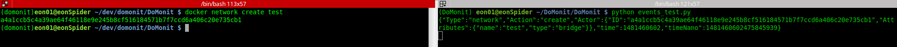

# DoMonit

A deadly simple monitoring tool for Docker - Using A Python Wrapper For Docker API.
[The Blog Post](https://medium.com/@eon01/monitoring-docker-with-python-domonit-34440b8c6830)

# Compatibility

A Python wrapper for Dokcer API 1.24 compatible with Docker 1.12.x and later.

# Purpose 

The purpose is to write python scripts easily for monitoring all of your Docker containers (running in a Linux distibution - other OS are coming soon in the roadmap of development).

# The Wrapper

This is the Alpha, moving to Beta very very soon :-)

The wrapper contains these classes:

```
api/
├── changes.py
├── containers.py
├── errors.py
├── ids.py
├── inspect.py
├── logs.py
├── process.py
└── stats.py
```

Where :

**Containers** : List containers

**Inspect** : Return low-level information on the container id

**Ids** : Return containers IDs

**Logs** : Get stdout and stderr logs from the container id

**Process** : List processes running inside the container id. On Unix systems this is done by running the ps command. This endpoint is not supported on Windows.

**Stats** : This endpoint returns a live stream of a container’s resource usage statistics.

# Using virtualenv:

```
virtualenv DoMonit
cd DoMonit 
git clone https://github.com/eon01/DoMonit.git
. bin/activate
cd DoMonit
pip install -r requirements.txt
#To Test:
python examples.py
```

# Example

This is an example script:

```
from api.containers import Containers
from api.ids import Ids
from api.inspect import Inspect
from api.logs import Logs
from api.process import Process
from api.changes import Changes
from api.stats import Stats


import json


c = Containers()
i = Ids()

print ("Number of containers is : %s " % (sum(1 for i in i.ids())))

if __name__ == "__main__":

    for c_id in i.ids():

        ins = Inspect(c_id)
        sta = Stats(c_id)
        proc = Process(c_id, ps_args = "aux")


        # Container name
        print ("\n#Container name")
        print ins.name()
 
        # Container id
        print ("\n#Container id")
        print ins.id()

        # Memory usage
        mem_u = sta.usage()

        # Memory limit
        mem_l = sta.limit()

        # Memory usage %
        print ("\n#Memory usage %")
        print  int(mem_u)*100/int(mem_l)


        # The number of times that a process of the cgroup triggered a "major fault"
        print ("\n#The number of times that a process of the cgroup triggered a major fault")
        print sta.pgmajfault()
  

        # Same output as ps aux in *nix
        print("\n#Same output as ps aux in *nix")
        print proc.ps()
```

For the following 5 running containers:

```
docker ps
CONTAINER ID        IMAGE               COMMAND                  CREATED             STATUS              PORTS               NAMES
1a29e9652822        instavote/vote      "gunicorn app:app -b "   12 seconds ago      Up 11 seconds       80/tcp, 100/tcp     vote_webapp_3
6ca598188d1a        instavote/vote      "gunicorn app:app -b "   12 seconds ago      Up 11 seconds       80/tcp, 100/tcp     vote_webapp_4
7f1a6bfaf95b        instavote/vote      "gunicorn app:app -b "   12 seconds ago      Up 11 seconds       80/tcp, 100/tcp     vote_webapp_5
e3a7066ba953        instavote/vote      "gunicorn app:app -b "   6 days ago          Up 5 hours          80/tcp, 100/tcp     vote_webapp_2
1e557c8dc5f7        instavote/vote      "gunicorn app:app -b "   6 days ago          Up 5 hours          80/tcp, 100/tcp     vote_webapp_1
```

the execution result of the example above is:


```
Number of containers is : 5 

#Container name
/vote_webapp_3

#Container id
1a29e9652822447a440799306f4edb65003bca9cdea4c56e1e0ba349d5112d3e

#Memory usage %
0.697797903077

#The number of times that a process of the cgroup triggered a major fault
15

#Same output as ps aux in *nix
{u'Processes': [[u'root', u'26636', u'0.0', u'0.2', u'76808', u'16228', u'?', u'Ss', u'15:43', u'0:00', u'/usr/local/bin/python2 /usr/local/bin/gunicorn app:app -b 0.0.0.0:80 --log-file - --access-logfile - --workers 4 --keep-alive 0'], [u'root', u'26773', u'0.0', u'0.2', u'88776', u'19976', u'?', u'S', u'15:43', u'0:00', u'/usr/local/bin/python2 /usr/local/bin/gunicorn app:app -b 0.0.0.0:80 --log-file - --access-logfile - --workers 4 --keep-alive 0'], [u'root', u'26784', u'0.0', u'0.2', u'88572', u'19800', u'?', u'S', u'15:43', u'0:00', u'/usr/local/bin/python2 /usr/local/bin/gunicorn app:app -b 0.0.0.0:80 --log-file - --access-logfile - --workers 4 --keep-alive 0'], [u'root', u'26787', u'0.0', u'0.2', u'88568', u'19816', u'?', u'S', u'15:43', u'0:00', u'/usr/local/bin/python2 /usr/local/bin/gunicorn app:app -b 0.0.0.0:80 --log-file - --access-logfile - --workers 4 --keep-alive 0'], [u'root', u'26793', u'0.0', u'0.2', u'88572', u'19828', u'?', u'S', u'15:43', u'0:00', u'/usr/local/bin/python2 /usr/local/bin/gunicorn app:app -b 0.0.0.0:80 --log-file - --access-logfile - --workers 4 --keep-alive 0']], u'Titles': [u'USER', u'PID', u'%CPU', u'%MEM', u'VSZ', u'RSS', u'TTY', u'STAT', u'START', u'TIME', u'COMMAND']}

...etc
```


# Testing Docker Events Stream Wrapper

This is a simple example:

```
#!/usr/bin/env python

from domonit.events import Events

# Events is a stream of json sent by Docker API. In the Events class, we are only streaming in the same way the Docker events like Docker API make it.

e = Events()
events = e.events()

for event in events:
    print event
```

The event: 

```
{"Type":"network","Action":"create","Actor":{"ID":"a4a1ccb5c4a39ae64f46118e9e245b8cf516184571b7f7ccd6a406c20e735cb1","Attributes":{"name":"test","type":"bridge"}},"time":1481460602,"timeNano":1481460602475845939}
```

is reported by the network creation:

```
docker network create test
```




# DoMonit Functions

For better uderstanfing and visibility, I used Python ```dir()``` here to list the different functions of every class under ```api/*```

```
python dir.py

Containers()
['__doc__', '__init__', '__module__', 'base', 'command', 'containers', 'created', 'host_config', 'image', 'image_id', 'labels', 'mounts', 'names', 'network_settings', 'ports', 'resp', 'session', 'status', 'url']


Ids()
['__doc__', '__init__', '__module__', 'base', 'ids', 'resp', 'session', 'url']


Inspect()
['__doc__', '__init__', '__module__', 'app_armor_profile', 'args', 'attach_stderr', 'attach_stdin', 'base', 'cmd', 'container_id', 'created', 'domainname', 'driver', 'entrypoint', 'env', 'exec_ids', 'exposed_ports', 'host_config_binds', 'host_config_blkio_device_read_bps', 'host_config_blkio_device_write_bps', 'host_config_blkio_device_write_iops', 'host_config_blkio_weight_device', 'host_config_cap_add', 'host_config_cap_drop', 'host_config_container_id_file', 'host_config_cpu_percent', 'host_config_cpu_period', 'host_config_cpu_shares', 'host_config_cpuset_cpus', 'host_config_cpuset_mems', 'host_config_devices', 'host_config_dns', 'host_config_dns_options', 'host_config_dns_search', 'host_config_extra_hosts', 'host_config_host_config_shm_size', 'host_config_ipc_mode', 'host_config_kernel_memory', 'host_config_links', 'host_config_log_config_config', 'host_config_log_config_type', 'host_config_lxc_conf', 'host_config_maximum_iobps', 'host_config_maximum_iops', 'host_config_memory', 'host_config_memory_reservation', 'host_config_memory_swap', 'host_config_network_mode', 'host_config_oom_kill_disable', 'host_config_oom_score_adj', 'host_config_pid_mode', 'host_config_port_bindings', 'host_config_privileged', 'host_config_publish_all_ports', 'host_config_readonly_rootfs', 'host_config_restart_policy_maximum_retry_count', 'host_config_restart_policy_name', 'host_config_security_opt', 'host_config_storage_opt', 'host_config_sysctls', 'host_config_ulimits', 'host_config_volume_driver', 'host_config_volumes_from', 'hostname', 'hostname_path', 'hosts_path', 'id', 'image', 'inspect', 'labels', 'log_path', 'mac_address', 'mount_label', 'mounts', 'name', 'network_disabled', 'network_settings_bridge', 'network_settings_endpoint_id', 'network_settings_gateway', 'network_settings_global_ipv6_address', 'network_settings_global_ipv6_prefixLen', 'network_settings_hairpin_mode', 'network_settings_ip_address', 'network_settings_ip_prefixLen', 'network_settings_ipv6_gateway', 'network_settings_link_local_ipv6_address', 'network_settings_link_local_ipv6_prefix_len', 'network_settings_mac_address', 'network_settings_networks', 'network_settings_ports', 'network_settings_sandbox_id', 'network_settings_sandbox_key', 'network_settings_secondary_ip_addresses', 'network_settings_secondary_ipv6_addresses', 'on_build', 'open_stdin', 'path', 'process_label', 'resolv_conf_path', 'resp', 'restart_count', 'session', 'state_dead', 'state_error', 'state_exit_code', 'state_finished_at', 'state_oom_killed', 'state_paused', 'state_pid', 'state_restarting', 'state_running', 'state_started_at', 'state_status', 'stdin_once', 'stop_signal', 'tty', 'url', 'user', 'volumes', 'working_dir']


Stats()
['__doc__', '__init__', '__module__', 'active_anon', 'active_file', 'base', 'blkio_stats', 'cache', 'container_id', 'cpu_stats', 'failcnt', 'hierarchical_memory_limit', 'inactive_anon', 'inactive_file', 'interfaces', 'limit', 'mapped_file', 'max_usage', 'memory_stats', 'networks', 'percpu_percpu_usage', 'percpu_period', 'percpu_stats', 'percpu_system_cpu_usage', 'percpu_throttled_periods', 'percpu_throttled_time', 'percpu_throttling_data', 'percpu_total_usage', 'percpu_usage', 'percpu_usage_in_kernelmode', 'percpu_usage_in_usermode', 'period', 'pgfault', 'pgmajfault', 'pgpgin', 'pgpgout', 'pids_stats_current', 'read', 'resp', 'rss', 'rss_huge', 'rx_bytes', 'rx_dropped', 'rx_errors', 'rx_packets', 'session', 'stats', 'stream', 'system_cpu_usage', 'throttled_periods', 'throttled_time', 'throttling_data', 'total_active_anon', 'total_active_file', 'total_cache', 'total_inactive_anon', 'total_inactive_file', 'total_mapped_file', 'total_pgfault', 'total_pgmajfault', 'total_pgpgin', 'total_pgpgout', 'total_rss', 'total_rss_huge', 'total_unevictable', 'total_usage', 'total_writeback', 'tx_bytes', 'tx_dropped', 'tx_errors', 'tx_packets', 'unevictable', 'url', 'usage', 'usage_in_kernelmode', 'usage_in_usermode', 'writeback']


Process()
['__doc__', '__init__', '__module__', 'base', 'container_id', 'processes', 'ps', 'ps_args', 'resp', 'session', 'titles', 'url']


Logs()
['__doc__', '__init__', '__module__', 'base', 'container_id', 'details', 'follow', 'logs', 'resp', 'session', 'since', 'stderr', 'stdout', 'tail', 'timestamps', 'url']


Changes()
['__doc__', '__init__', '__module__', 'base', 'changes', 'container_id', 'resp', 'session', 'url']


Events()
['__doc__', '__init__', '__module__', 'base', 'events', 'resp', 'session', 'url']

```


# Naming Conventions

Let's take the example of the "inspect" call.
Docer replies with data similar to the following one:

```
{
    "AppArmorProfile": "",
    "Args": [
        "-c",
        "exit 9"
    ],
    "Config": {
        "AttachStderr": true,
        "AttachStdin": false,
        "AttachStdout": true,
        "Cmd": [
            "/bin/sh",
            "-c",
            "exit 9"
        ],
        "Domainname": "",
        "Entrypoint": null,
        "Env": [
            "PATH=/usr/local/sbin:/usr/local/bin:/usr/sbin:/usr/bin:/sbin:/bin"
        ],
        "ExposedPorts": null,
        "Hostname": "ba033ac44011",
        "Image": "ubuntu",
        "Labels": {
            "com.example.vendor": "Acme",
            "com.example.license": "GPL",
            "com.example.version": "1.0"
        },
        "MacAddress": "",
        "NetworkDisabled": false,
        "OnBuild": null,
        "OpenStdin": false,
        "StdinOnce": false,
        "Tty": false,
        "User": "",
        "Volumes": {
            "/volumes/data": {}
        },
        "WorkingDir": "",
        "StopSignal": "SIGTERM"
    },
    "Created": "2015-01-06T15:47:31.485331387Z",
    "Driver": "devicemapper",
    "ExecIDs": null,
    "HostConfig": {
        "Binds": null,
        "MaximumIOps": 0,
        "MaximumIOBps": 0,
        "BlkioWeight": 0,
        "BlkioWeightDevice": [{}],
        "BlkioDeviceReadBps": [{}],
        "BlkioDeviceWriteBps": [{}],
        "BlkioDeviceReadIOps": [{}],
        "BlkioDeviceWriteIOps": [{}],
        "CapAdd": null,
        "CapDrop": null,
        "ContainerIDFile": "",
        "CpusetCpus": "",
        "CpusetMems": "",
        "CpuPercent": 80,
        "CpuShares": 0,
        "CpuPeriod": 100000,
        "Devices": [],
        "Dns": null,
        "DnsOptions": null,
        "DnsSearch": null,
        "ExtraHosts": null,
        "IpcMode": "",
        "Links": null,
        "LxcConf": [],
        "Memory": 0,
        "MemorySwap": 0,
        "MemoryReservation": 0,
        "KernelMemory": 0,
        "OomKillDisable": false,
        "OomScoreAdj": 500,
        "NetworkMode": "bridge",
        "PidMode": "",
        "PortBindings": {},
        "Privileged": false,
        "ReadonlyRootfs": false,
        "PublishAllPorts": false,
        "RestartPolicy": {
            "MaximumRetryCount": 2,
            "Name": "on-failure"
        },
        "LogConfig": {
            "Config": null,
            "Type": "json-file"
        },
        "SecurityOpt": null,
        "Sysctls": {
                "net.ipv4.ip_forward": "1"
        },
        "StorageOpt": null,
        "VolumesFrom": null,
        "Ulimits": [{}],
        "VolumeDriver": "",
        "ShmSize": 67108864
    },
    "HostnamePath": "/var/lib/docker/containers/ba033ac4401106a3b513bc9d639eee123ad78ca3616b921167cd74b20e25ed39/hostname",
    "HostsPath": "/var/lib/docker/containers/ba033ac4401106a3b513bc9d639eee123ad78ca3616b921167cd74b20e25ed39/hosts",
    "LogPath": "/var/lib/docker/containers/1eb5fabf5a03807136561b3c00adcd2992b535d624d5e18b6cdc6a6844d9767b/1eb5fabf5a03807136561b3c00adcd2992b535d624d5e18b6cdc6a6844d9767b-json.log",
    "Id": "ba033ac4401106a3b513bc9d639eee123ad78ca3616b921167cd74b20e25ed39",
    "Image": "04c5d3b7b0656168630d3ba35d8889bd0e9caafcaeb3004d2bfbc47e7c5d35d2",
    "MountLabel": "",
    "Name": "/boring_euclid",
    "NetworkSettings": {
        "Bridge": "",
        "SandboxID": "",
        "HairpinMode": false,
        "LinkLocalIPv6Address": "",
        "LinkLocalIPv6PrefixLen": 0,
        "Ports": null,
        "SandboxKey": "",
        "SecondaryIPAddresses": null,
        "SecondaryIPv6Addresses": null,
        "EndpointID": "",
        "Gateway": "",
        "GlobalIPv6Address": "",
        "GlobalIPv6PrefixLen": 0,
        "IPAddress": "",
        "IPPrefixLen": 0,
        "IPv6Gateway": "",
        "MacAddress": "",
        "Networks": {
            "bridge": {
                "NetworkID": "7ea29fc1412292a2d7bba362f9253545fecdfa8ce9a6e37dd10ba8bee7129812",
                "EndpointID": "7587b82f0dada3656fda26588aee72630c6fab1536d36e394b2bfbcf898c971d",
                "Gateway": "172.17.0.1",
                "IPAddress": "172.17.0.2",
                "IPPrefixLen": 16,
                "IPv6Gateway": "",
                "GlobalIPv6Address": "",
                "GlobalIPv6PrefixLen": 0,
                "MacAddress": "02:42:ac:12:00:02"
            }
        }
    },
    "Path": "/bin/sh",
    "ProcessLabel": "",
    "ResolvConfPath": "/var/lib/docker/containers/ba033ac4401106a3b513bc9d639eee123ad78ca3616b921167cd74b20e25ed39/resolv.conf",
    "RestartCount": 1,
    "State": {
        "Error": "",
        "ExitCode": 9,
        "FinishedAt": "2015-01-06T15:47:32.080254511Z",
        "OOMKilled": false,
        "Dead": false,
        "Paused": false,
        "Pid": 0,
        "Restarting": false,
        "Running": true,
        "StartedAt": "2015-01-06T15:47:32.072697474Z",
        "Status": "running"
    },
    "Mounts": [
        {
            "Name": "fac362...80535",
            "Source": "/data",
            "Destination": "/data",
            "Driver": "local",
            "Mode": "ro,Z",
            "RW": false,
            "Propagation": ""
        }
    ]
}
```

In DoMonit code the function that will reply with the name of the restart policy should have the following name:

```
def host_config_restart_policy_name():
    [...]
    return [...]
```

- Functions name are in small letters and describes the "path" to follow in the json response to get it.
- ```HostConfig``` should be named ```host_config``` and ```RestartPolicy``` should be named ```restart_policy``` which gives ```host_config_restart_policy_name```

```
    "HostConfig": {
        "":"",
        "":"",
        "":"",
	[...]
        "RestartPolicy": {
            "MaximumRetryCount": 2,
            "Name": "on-failure"
        },
        [...]
    },
```

# How To Contribute
- Submit a feature proposal if you have new features to add. If you fixing a bug, this step is optional
- Fork the repo and then clone it to your development machine

```
git clone https://github.com/eon01/DoMonit.git
```
- Create a new branch
```
git checkout -b my-new-feature
```
- Add your code 
- Follow the code style and naming conventions
- Write some documentations and tests
- Commit your changes and push the new branch to your fork
```
git add .
git commit -m 'Your detailed description'
```

- If the remote repos (the forked one) is not set, type:
```
git remote set-url origin https://github.com/<your_username>/DoMonit
```
- Push changes:

```
git push origin my-new-feature
```
- Submit a pull request
- You can get a list of your commits:
```
git log --oneline origin/master..my-new-feature
```
- It is optional but if accepted and merged, you can delete your branch (remotly and locally)
```
git checkout master
git push origin :my-new-feature
git branch -D my-new-feature
```

# ToDo
- Documentation
- Exception & timeout handling
- Unit testing
